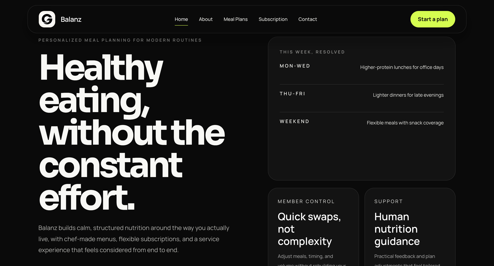
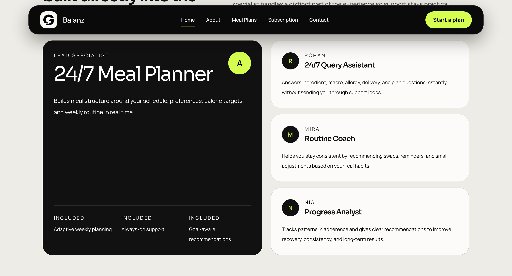
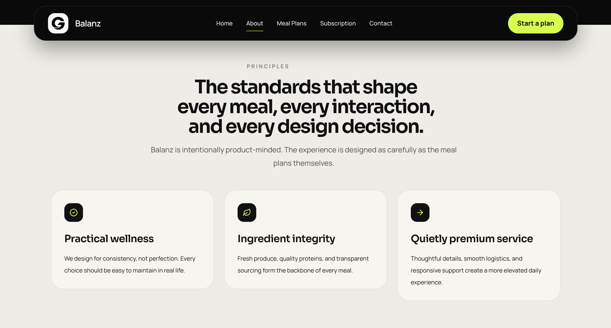
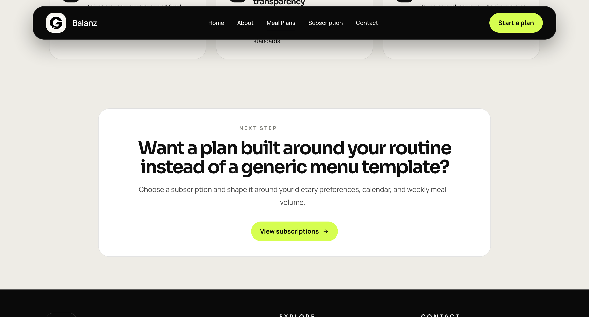
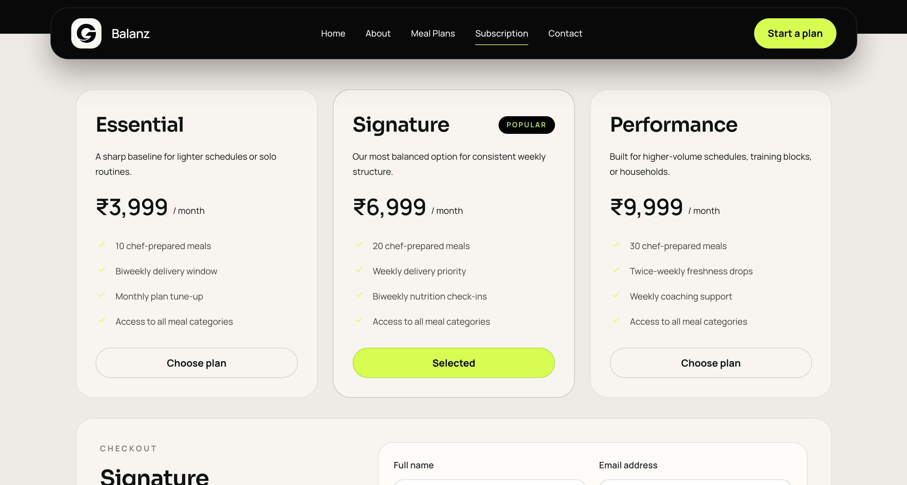

# Balanz

Balanz is a polished Next.js marketing site for a personalized nutrition and meal subscription brand. The app presents the brand story, meal plan offering, subscription tiers, and contact flow through a premium, editorial-style interface.















## Overview

The site is built as a multi-page marketing experience for a wellness brand focused on:

- personalized meal planning
- chef-led meal categories
- flexible subscription plans
- nutrition support and guided onboarding

## Tech Stack

- Next.js 15
- React 19
- TypeScript
- Tailwind CSS
- Radix UI
- Framer Motion

## Pages

- `/` - landing page with hero, feature highlights, meal categories, AI support specialists, and FAQs
- `/about` - brand story, principles, and product philosophy
- `/meal-plans` - meal plan presentation and category overview
- `/subscription` - subscription tiers, benefits, and FAQs
- `/contact` - contact and enquiry flow

## Getting Started

Install dependencies and run the development server:

```bash
npm install
npm run dev
```

Then open [http://localhost:3000](http://localhost:3000).

## Available Scripts

```bash
npm run dev
npm run build
npm run start
npm run lint
```
